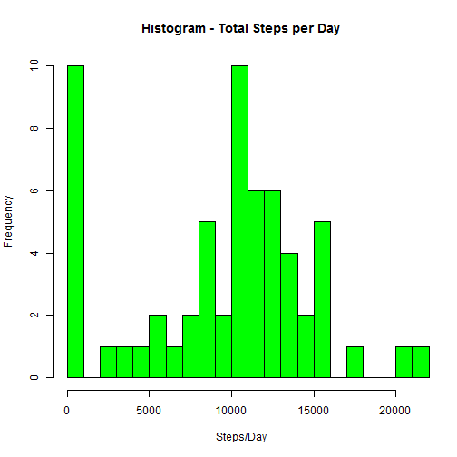

This document is for the Coursera Reproducable Research course.  

The analysis is based on two months of data collected from a personal activity monitoring device on an anonymous individual, taken in 5 minute intervals each day for the months of October and November, 2012.  

##What is the mean total number of steps taken per day?##

**Steps**  
1. Calculate the total number of steps taken per day.  
2. Make a histogram of the total number of steps taken per day.  
3. Calculate and report the mean and median of the total number of steps taken per day.  

This is the code that reads in and formats the data:  


```r
# set working directory to the data location & read in the data
setwd("C:/Dropbox/Data Scientist Course/5 - Reproducable Research/Assignment1/")
df <- read.csv("activity.csv", header=T, sep=",",na.strings="NA",stringsAsFactor=F)

# Make sure the values are integers
df$steps <- as.integer(df$steps)

# aggregate and get the sum of steps per day
totalSteps <- aggregate(df$steps, by=list(Date=df$date), FUN=sum, na.rm=TRUE)
colnames(totalSteps)[2] <- "TotalSteps"

# Get the mean and median steps
meanSteps <- as.integer(mean(totalSteps$TotalSteps))
medianSteps <- as.integer(median(totalSteps$TotalSteps))

# Get the maximum number of daily steps for use in the histogram xlim parameter
maxTotalSteps <- max(totalSteps$TotalSteps)
```

This is a Histogram of the total number of steps taken each day:


```r
hist(totalSteps$TotalSteps, col="green",main="Histogram - Total Steps per Day",xlab="Steps/Day", ylab="Frequency", breaks=20, xlim=c(0,maxTotalSteps))
```

 

The mean number of steps taken each day is 9354.  
The median number of steps taken each day is 10395.  

##What is the average daily activity pattern?##

**Steps**  
1. Make a time series line plot of the 5-min interval and average number of steps taken, averaged across all days.  
2. Report which 5-minute interval, on average across all the days in the dataset, contains the maximum number of steps.  


```r
# Get the average steps by interval
avgStepsByInterval <- aggregate(df$steps ~ df$interval, FUN=mean)
names(avgStepsByInterval) <- c("Interval", "Steps")

# Get the interval with the maximum number of average steps
maxStepsEntry <- avgStepsByInterval[which.max(avgStepsByInterval$Steps),]
maxInterval <- maxStepsEntry$Interval

# Plot the Steps Per Interval
plot(avgStepsByInterval$Interval, avgStepsByInterval$Steps, type="l", main="Average Steps Per Interval", xlab ="Interval in 5 Minute Increments", ylab="Number of Steps")
```

 

Interval 835 contains the maximum number of steps (206)    

##Inputting Missing Values##  

**Steps**  
1. Calculate and report the total number of missing values in the dataset (# of rows w/ NAs).  
2. Fill in the missing values to reduce the introduction of bias in some calculations.  
3. Create a new dataset equal to the original dataset but with missing data filled in.  
4. Make a histogram of the total number of steps taken per day.  
5. Report the mean and median number of steps taken per day.  
6. Determine and report whether the recent values differ significantly from the orignal data findings.  


```r
# Determine the number of rows with missing values
totMissing <- nrow(df) - sum(complete.cases(df))
```
The total number of missing values in the dataset is 2304  


```r
# Create a new dataset to work with
newDF <- df

# Create a new dataset with missing values filled in with the mean value per day
# avgSteps value is the derived from dividing the average steps / day by the number of intevals per day
avgSteps <- meanSteps / nrow(avgStepsByInterval)

# Replace the missing values with the average value
newDF[is.na(newDF)] <- avgSteps

# Make sure the values are integers
newDF$steps <- as.integer(newDF$steps)

# aggregate and get the sum of steps per day
newTS <- aggregate(newDF$steps, by=list(Date=newDF$date), FUN=sum)
colnames(newTS)[2] <- "TotalSteps"

# Get the mean and median steps
newMeanSteps <- as.integer(mean(newTS$TotalSteps))
newMedianSteps <- as.integer(median(newTS$TotalSteps))

hist(newTS$TotalSteps, col="green",main="Histogram - Total Steps per Day",xlab="Steps/Day", ylab="Frequency", breaks=20, xlim=c(0,maxTotalSteps))
```

 

The normalized mean number of steps taken each day is 10562.  
The normalized median number of steps taken each day is 10395.  

The difference between the original and 'normalized' values is noticable but not significant. The mean value for the original dataset was 9354 as compared to the normalized mean of 10562, which is also reflected as a slight change in the middle of the histogram. In addition, the 0 -to- 1000 Steps/Day count column in the 'normalized' histogram decreased considerably due to the elimination of a large number of missing values.

The median values were unchanged between the two datasets.  

##Are there differences in activity patterns between weekdays and weekends?##

**Steps**  
1. Create a new factor variable in the dataset indicating weekday and weekend.  
2. Create a panel plot of time series interval and average steps data, averaged across all weekday and weekend days. The panel plot should look like the example provided in the README.md file on the GitHub repository for this assignment.


```r
library(lattice)
df$day <- weekdays(as.Date(df$date))

df$day <- gsub("Monday", df$day, replacement="Weekday")
df$day <- gsub("Tuesday", df$day, replacement="Weekday")
df$day <- gsub("Wednesday", df$day, replacement="Weekday")
df$day <- gsub("Thursday", df$day, replacement="Weekday")
df$day <- gsub("Friday", df$day, replacement="Weekday")
df$day <- gsub("Saturday", df$day, replacement="Weekend")
df$day <- gsub("Sunday", df$day, replacement="Weekend")
df$day <- as.factor(df$day)

stepsByDay <- aggregate(df$steps ~ df$day+df$interval, FUN=mean)
names(stepsByDay) <- c("Day", "Interval", "Steps")

xyplot(Steps ~ Interval|Day, stepsByDay, layout=c(1,2), type="l")
```

 

From the above graphs there seems to be somewhat higher activity through the day on the weekends versus the weekdays, after an initial period in what appears to be the morning time, for which there is moderate activity seen in both graphs.  


